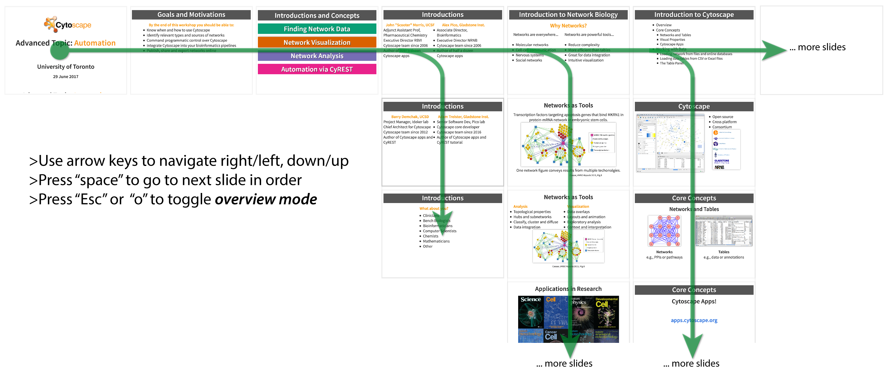
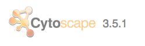
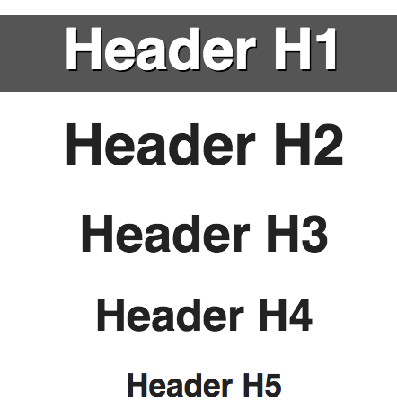
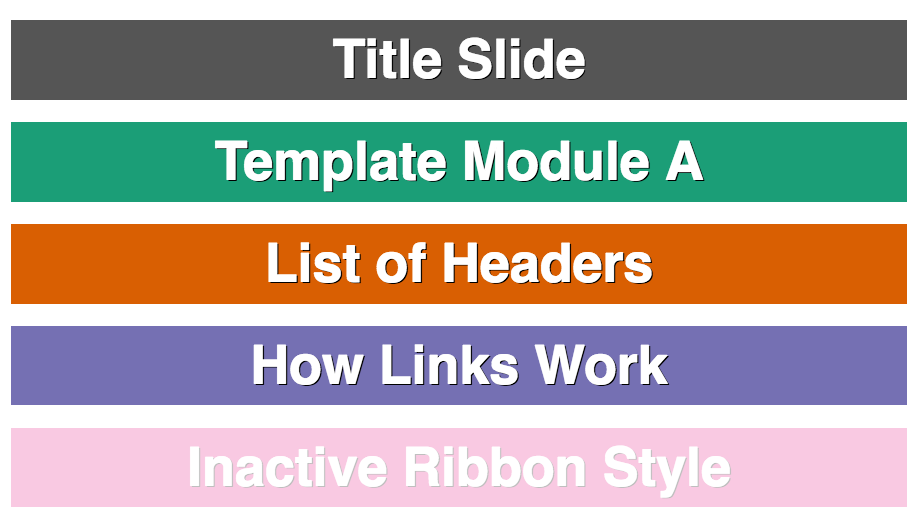
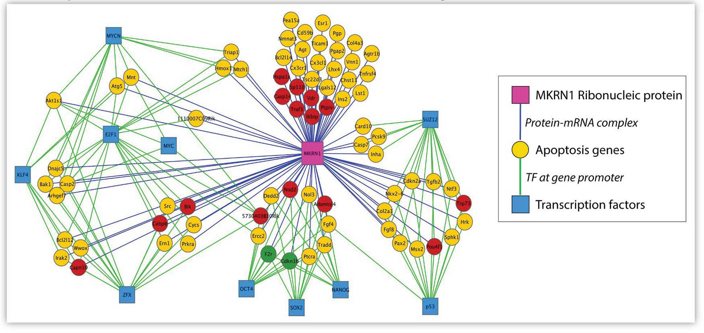
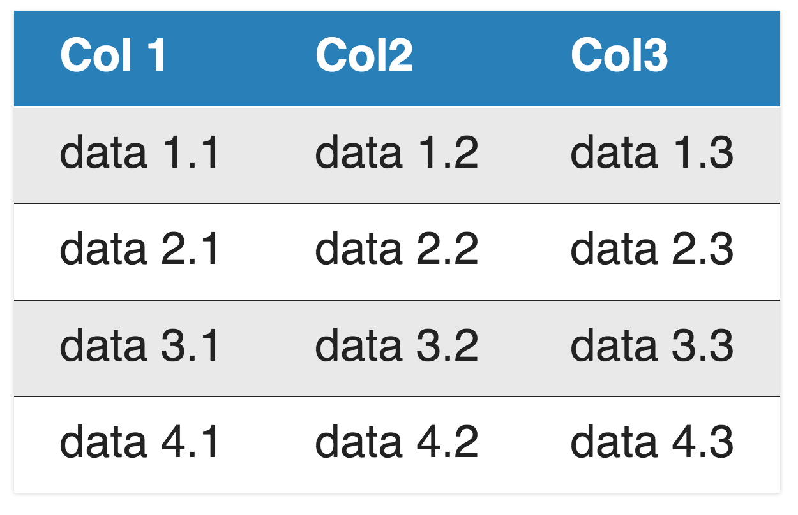

# Cytoscape Tutorials Using Reveal
This repo contains a collection of training *modules* for Cytoscape that can be used to compose workshop presentations. The repo also includes a clone of the reveal.js code that enables the presentation mode for these modules and workshops.

## Presentations, Protocols and Modules
Check out the [current list of training materials](https://cytoscape.github.io/cytoscape-tutorials/contents/).

Building upon the powerful framework of reveal.js, we have developed a few custom features and styles tailored for use in Cytoscape training materials. In addition to the contents below, you can learn more about using reveal.js in general from the [reveal-readme](reveal-readme.md).

## Table of Contents
- [Presenting a Cytoscape Tutorial](#presenting)
- [Sharing Cytoscape Tutorials](#sharing)
- [Building Your Own Training Materials](#building)
- [Cytoscape Custom Style](#style)
  - [Version](#version)
  - [Headings](#headings)
  - [Slide Links](#slide_links)
  - [Ribbons](#ribbons)
  - [Highlight](#highlight)
  - [Code](#code)
  - [Lists](#lists)
  - [Images](#images)
  - [Citations](#citations)
  - [Animation](#animation)
  - [Columns](#columns)
  - [Tables](#tables)
  - [Integration with CyBrowser and CyCommands](#integration-with-cybrowser-and-cycommands)
  - [Editing the Cytoscape theme](#editing-cytoscape-theme)
  - [Editing the base theme](#editing-base-theme)	

## Presenting
Browse the available training materials already prepared:
* [presentations](https://cytoscape.github.io/cytoscape-tutorials/contents/#/presentations) -- Specific programs compiled for target audiences; designed for projector presentation to a group; typically composed of custom slides together with general modules (see below).
* [modules](https://cytoscape.github.io/cytoscape-tutorials/contents/#/modules) -- Concise material focused on specific tasks; intended to be reused in
 multiple presentations (see above).
* [protocols](https://cytoscape.github.io/cytoscape-tutorials/contents/#/protocols) -- General tutorials targeting common workflows or protocols; designed for display on individual monitors and interactivity via CyBrowser; typically linked to individually or in a presentation.

#### Navigating
Use arrow keys, "space" or the on-screen arrows (lower right) to navigate the slides. Take note of modules that are organized ___vertically___ within a presentation.

[](#null)

#### Online
You can access training materials at any time via a web browser. All content is tested in the latest versions of Firefox and Chrome. Simply navigate to the corresponding url, e.g., 

```
https://cytoscape.github.io/cytoscape-tutorials/presentations/advanced-automation.html
```

#### Offline
You can also generate a PDF version of any presentation or protocol and save it as a local file to share or present offline. Note that animated slides do not display as separate slides in PDF form, but rather as single slides in their final form. However, protocols  should be composed in such a way to display properly in PDF. Simply append ```?print-pdf``` to the end of the url for any protocol or protocol module, e.g.,

```
https://cytoscape.github.io/cytoscape-tutorials/protocols/modules/basic-data-visualization/?print-pdf
```
Then choose File>Print... and set the orientation to ```landscape``` and Save to PDF. Verify that the page breaks are correct throughout the presentation. For longer presentations, you may need to generate the PDF using an alternative approach, see [Decktape and PhantomJS](https://github.com/astefanutti/decktape). Example usage:

```
./phantomjs decktape.js automatic https://cytoscape.github.io/cytoscape-tutorials/presentations/advanced-automation.html#/ advanced-automation.pdf
```

## Sharing
Please feel free to use, share, copy or adapt any of the training materials you find here. They are all implicitly published under the CC0 waiver for maximum reuse potential.

## Building
In order to adapt or compose your own tutorial, and you do not already have edit permissions for this repo, you can simply [fork the repo](https://github.com/cytoscape/cytoscape-tutorials). If your content is of general use, please submit a pull request and we'll be happy to acccept it.  

If you have a suggestion to make regarding the content and don't have the time or inclination to do the coding, please [submit your request in the issue tracker](https://github.com/cytoscape/cytoscape-tutorials/issues).

If you are going to edit a tutorial and are not already familiar with Reveal.js, you will want to [start with the reveal.js docs](reveal-readme.md) to learn how to setup your development environment and the basics of building content.  Once you are familiar with reveal, you will want to review the common elements and custom styles available in our repo for Cytoscape tutorials (see Style below). Also refer to [our templates](https://cytoscape.github.io/cytoscape-tutorials/contents/#/templates) with example slides and style usage.

In order to preview your local changes, you can simply open the HTML files in your browser, e.g., using the ```open``` command line function. Alternatively, for a live preview that updates in real-time, you can run ```npm start``` from the top directory. For npm functionality, you will need to install node.js (https://nodejs.org) and run ```npm install``` the first time (see [full setup](https://github.com/hakimel/reveal.js/blob/master/README.md#full-setup)).

#### Organization
The first thing to notice about our repo is the organization. From the top level, you will find ```presentations``` and ```protocols```. These leverage different CSS styles and different sets of ```modules```. 
```
|--presentations/
|  |--advanced-automation.html
|  |--(other presentations)
|  |--modules/
|     |--intro-cytoscape/
|     |--(other presentation modules)
|--protocols/
|  |--modules/
|     |--loading-omics-data/
|     |--(other protocol modules)
```
Each level can contain image assets that are relevant at that level. For example, images that are likely to only be needed in a single module should be kept in that module's directory. Images that might be useful to many tutorials should be kept in the top level's ```assets/images```. 

Each level will have named html files or ```index.html``` files, which are the files that one presents and shares. Modules directories will also have ```module.html``` files which contain the slide content that is referenced and pulled into the presentable html files. For example, the ```index.html``` file for the ```intro-cytoscape``` module includes reveal headers, scripts and this line of code to pull in the slide content:

```
<section data-external="modules/intro-cytoscape/module.html"></section>
```

#### Strategies
1. **Composing a presentation from existing modules**  
Say you are putting together a presentation for class or workshop, but the existing presentations here aren't exactly right. You want a bit of customization, but you don't want to start over from scratch.  Well, with this strategy you can reuse any of the modules here and pull them together in any order you like, while also adding custom slides before, after or between modules (though not *within* a given module). 

   See the [presentation template](https://cytoscape.github.io/cytoscape-tutorials/presentations/template.html) and [code](https://github.com/cytoscape/cytoscape-tutorials/tree/gh-pages/presentations/template.html) to see how simple it is to reference existing modules, like so ```<section data-external="modules/template-a/module.html"></section>```.
   
   You can insert as many modules as you'd like and in any order. Furthermore, you can add slides using the ```section``` tag before or after modules in order to customize, e.g., with a title slide. This strategy works for protocols in the same way.
   
2. **Composing a presentation module**
Say you want to present a topic in detail, but it is not covered by any of the existing modules here. Well, you can make your own modules that can then be used (and reused) in multiple compositions (see Strategy 1). If possible, try to make the module focused on a single topic. Make more than one module, if necessary. And try to make the slides generic enough so that the module can be reused by other presenters, e.g., avoid content that is particular to only one audience, venue or setting.  

   See a [presentation module template](https://cytoscape.github.io/cytoscape-tutorials/presentations/modules/template-a/index.html) and [code](https://github.com/cytoscape/cytoscape-tutorials/tree/gh-pages/presentations/modules/template-a) to see how to build a module and how sample slides are formatted. Note how the ```moduled.html``` file is simply a set of ```<section>``` tags; while the ```index.html``` is generic wrapper you can copy/paste to make your sections work as a reveal.js presentation. The Style section below will cover most of the aspects of reveal you'll need to know to build a set of slides. 

## Style
We have developed [custom themes for Cytoscape tutorials](https://github.com/cytoscape/cytoscape-tutorials/tree/gh-pages/css/theme). These stylesheets provide settings and features tailored for our content, making it easier to put together (and reuse) training materials in this repo. Review how to use these customizations below...

### Version
To help develop training material that is accurate and current, we developed a custom footer and variable to specify the version of Cytoscape that the content pertains to. You can update the version tag in the named html or index.html files within the footer div:
```
<version>3.5.1</version>
```
[](#null)

### Headings
We have customized heading tags for the Cytoscape tutorial styles:

[](#null)

***[example slide](https://cytoscape.github.io/cytoscape-tutorials/presentations/modules/template-a/index.html#/headers)***

### Slide Links
There are many ways to link to slides *within* your presentation. Here are a few of the most useful ones...

```
<a href="#/2/3">Link to slide by position (e.g., second slide over, third slide down)</a>
<a href="#/my-fav-slide">Link slide by name (e.g., section id="my-fav-slide")</a>
<a href="#" class="navigate-next">Link to next slide</a>
```
***[example slide](https://cytoscape.github.io/cytoscape-tutorials/presentations/template.html#/links)***

### Ribbons
These are ideal for making interactive Agenda or Outline slides. They have a similar style as h1 headers, but are designed to work together with slide links (or external links) and have the nifty behavior of automatically stacking and coloring themselves when you list more than one.

```
<a href="#/"><ribbon>Title Slide</ribbon></a>
<a href="#/3"><ribbon>Template Module A</ribbon></a>
<a href="#/headers"><ribbon>List of Headers</ribbon></a>
<a href="#" class="navigate-next"><ribbon>How Links Work</ribbon></a>
<a class="inactive"><ribbon>Inactive Ribbon Style</ribbon></a>
```



*Pro tip: if you indicate ```class="inactive"``` then you can gray-out a ribbon and disable its link. This is useful for mid-presentation review of the agenda, i.e., to remind the audience know what's been covered already and where you are at in the presentation.*

***[example slide](https://cytoscape.github.io/cytoscape-tutorials/presentations/template.html#/ribbons)***

### Highlight
Use the ```<highlight>``` tag to highlight text with the Cytoscape-orange color

***[example slide](https://cytoscape.github.io/cytoscape-tutorials/presentations/modules/template-a/index.html#/highlight)***

### Code
Reveal used [highlightjs](https://highlightjs.org/) to format code snippets. 

```
<pre><code data-trim>
if (files != null) {
   for (int i=0; i < files.length; i++) {
       String filename = files[i];
   }
}
</code></pre>
```

***[example slide](https://cytoscape.github.io/cytoscape-tutorials/presentations/modules/template-a/index.html#/code)***

### Lists
Typical usage of ```<ul>``` for unordered lists and ```<ol>``` for ordered lists is supported with ```<li>``` tagging each list item.

### Images
Images are automatically scaled, centered and given a drop shadow border. Common customizations can be made with ```style``` settings, such as width...

```

```


You can also float the image to the left (or right) side by appending ```"float:left"``` to the style.

*Pro tip: If you have local copies of the images you want to include, upload them into the same directory as the html file, but include the path in ```src``` relative to the presentation (or protocol) directory, like in the example above. The index.html wrapper includes a base href="../.." so that the paths will work for both modules and presentations. If these images are likely to be used by multiple modules or presentations, you can also upload them to the top level ```assets/images``` dir, in which case the relative path in ```src``` should be "../assets/images".*

### Citations
Use the ```<small>``` tag to format citations at the bottom of slides

***[example slide](https://cytoscape.github.io/cytoscape-tutorials/presentations/modules/template-b/index.html#/list-image-cit)***

### Animation
The ```fragment``` class can be added to any html elements (e.g., paragraphs, images, list items) to set them up for animation, i.e., step-wise display. If you want to animate more than one element at the same time, simply wrap them in a div and add ```class="fragment"``` to it. You can also specify the type of animation per fragment...

```
<p class="fragment grow">grow</p>
<p class="fragment shrink">shrink</p>
<p class="fragment fade-out">fade-out</p>
<p class="fragment fade-up">fade-up (also down, left and right!)</p>
<p class="fragment current-visible">visible only once</p>
<p class="fragment highlight-current-blue">blue only once</p>
<p class="fragment highlight-red">highlight-red</p>
<p class="fragment highlight-green">highlight-green</p>
<p class="fragment highlight-blue">highlight-blue</p>
```

If you want an element to fade-out after fading-in, you can combine fragments like so...

```
<span class="fragment fade-in">
		<span class="fragment fade-out">I'll fade in, then out</span>
</span>
 ```
And for more precise control over the order and combination of animated fragments, you can explicity specify an index number...

```
<p class="fragment" data-fragment-index="3">Appears last</p>
<p class="fragment" data-fragment-index="1">Appears first</p>
<p class="fragment" data-fragment-index="2">Appears second</p>
 ```

***[example slide](https://cytoscape.github.io/cytoscape-tutorials/presentations/modules/template-b/index.html#/frag-list)***

### Columns
The Cytoscape stylesheet includes a custom ```column``` class which can be applied to two consecutive divs to automatically get a two-column layout for your slide content.

```
<div class="column">
	...contents for left column...
</div>
<div class="column">
	...contents for right column...
</div>
```

***[example slide](https://cytoscape.github.io/cytoscape-tutorials/presentations/modules/template-b/index.html#/two-columns)***

### Tables
The default table style includes a distinct header and background shading on alternating rows. Using ```table```, ```th```, ```tr``` and ```td``` as you normally would, results in a styled table like this...



***[example slide](https://cytoscape.github.io/cytoscape-tutorials/presentations/modules/template-b/index.html#/table)***

### Integration with CyBrowser and CyCommands
CyBrowser allows for viewing any html page in Cytoscape. Together with [CyCommands](http://apps.cytoscape.org/apps/commandtool), this makes it possible to automate tutorial content with buttons and/or links. For example, if the tutorial describes how to load a network, a button to automatically load the network can be included. 

Since these tutorials can be viewed in any web browser, and not just CyBrowser, but with a combination of javascript and css we can hide automation in all browsers other than CyBrowser. This is accomplished by enclosing the button code in a div, which in turn is controlled by javascript to hide it if the html is opened outside of CyBrowser. 

To include a button, add a div of class "cybrowser". The example below adds a button that imports a specific network (galFiltered.sif), using the "network load url" CyCommand:
    
```
<pre><code data-trim>
<div class="cybrowser">
        <input type="button" class="btn btn-primary" onclick="cybrowser.executeCyCommand('network load url url=https://cytoscape.github.io/cytoscape-tutorials/protocols/data/galFiltered.sif');" value="Load network"/>
    </div>
</code></pre>
```

To hide the "cybrowser" div, and thus the button, outside of CyBrowser, the following javascript should be added to the parent index file. For example, if the automation code was added to a module.hml file, the javascript should be added to the **body** of the index.html file that includes that module.
Similarly, there is also a "not-cybrowser" div class that can be used to customize content for regular browser vieweing.

```
<pre><code data-trim>
<script>
	Reveal.addEventListener( 'ready', function() {
	if(!window.navigator.userAgent.includes('CyBrowser')){
		var divs = document.getElementsByClassName("cybrowser")
		for (var i=0;i<divs.length;i++){
			divs[i].style.display = "none";
		}
	} else {
		var divs = document.getElementsByClassName("not-cybrowser")
		for (var i=0;i<divs.length;i++){
			divs[i].style.display = "none";
		}
	}
});
</script>  
</code></pre>
```

### Editing Cytoscape Theme
We have two customized stylesheets for presentations and protocols (.css). Please do *not* edit the CSS files directly. If you want to make changes to the stylesheets or make your own, you will need to work with source and template files (.scss) and then rebuild the CSS files using grunt.

```
|--css/theme/
|  |--cytoscape-presentation-1.css
|  |--cytoscape-protocol-1.css
|  |--source/
|     |--cytoscape-presentation-1.scss
|     |--cytoscape-protocol-1.scss
|  |--template
|     |--theme.scss
|     |--settings.scss
|     |--mixins.scss
```

For example, if you wanted to change something just in the presentation CSS, then you would make the edit in the corresponding SCSS file in the ```source``` directory and then run ```grunt css-themes```. An updated CSS file will then be automatically built. Grunt requires the installation of node.js (https://nodejs.org) and then grunt ```npm install -g grunt-cli```. Common errors are caused by either an old or outdated version of node.js in which case you'll need to either perform an update ```npm update -g npm``` or install a new one via the [nodejs website](https://nodejs.org). 

### Editing Base Theme
If you want to make a global edit to all styles, e.g., a bug fix or new feature relevant to both presentations and protocols, then you will need to edit the files in the ```template``` directory. Check ```theme.scss``` and ```settings.scss``` first, unless you are familiar with mixins. After making these edits, you'll need to run ```grunt css-themes``` to rebuild the CSS files, as described above.

If you are not sure where to make an edit, simply [file a issue](https://github.com/cytoscape/cytoscape-tutorials/issues) for the project and we'll advise or make the edit for you.
